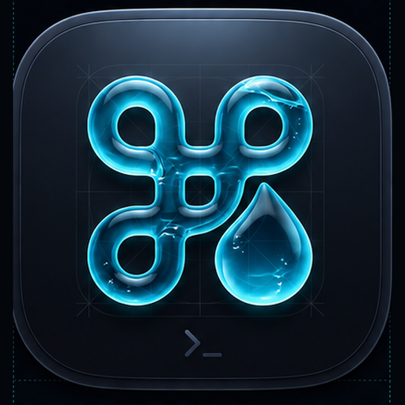
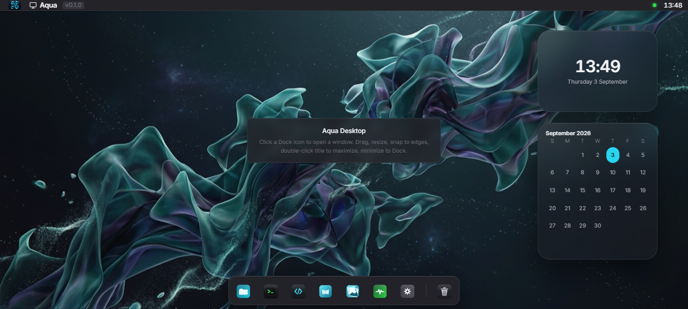
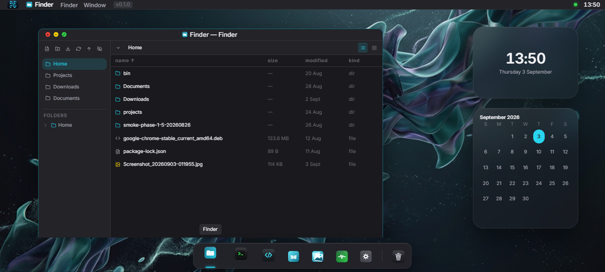
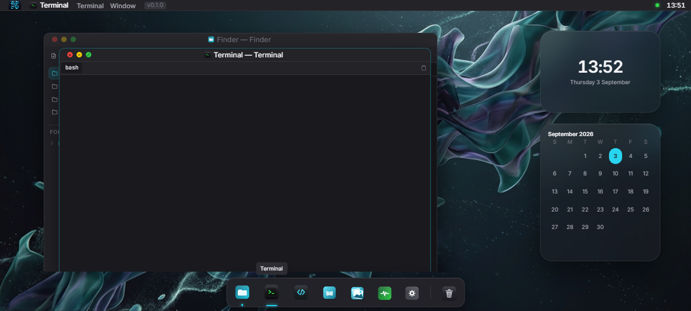
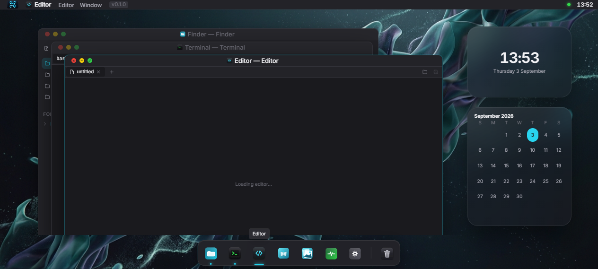

# Aqua — *WSL, at home.*

<p align="center">
  
  <br/>
  <em>A macOS-mannered desktop for WSL Ubuntu — Finder, Terminal, Editor, Spotlight, and a full window manager, shipped as a native Windows app.</em>
  <br/><br/>
  <a href="https://github.com/abuAbdur-rahman/aqua/releases"><strong>Download → Releases</strong></a>
</p>

<p align="center">
  
  
  
  
  
  
  
</p>

---

## Why Aqua?

WSL Ubuntu is powerful, but daily driving it means juggling raw `bash`, Windows Explorer, and a browser tab — nothing feels like a real desktop. Aqua fixes that: a native Tauri window that looks and behaves like macOS, backed by a Rust daemon living *inside* WSL that owns the real filesystem, processes, and shell.

Not a demo — the goal is to actually use this instead of Explorer + Terminal for day-to-day WSL work.

---

## Screenshots

Captured from the web build (`pnpm -C app dev` → `http://localhost:1420`) via automated browser.

<table>
<tr>
<td width="50%">

**Desktop — Widgets & Dock**

<br/>


*Cool-blue dark surfaces, clock & calendar widgets, macOS-style dock*

</td>
<td width="50%">

**Finder — File Browser**

<br/>


*Breadcrumb, sidebar, grid/list, Quick Look preview*

</td>
</tr>
<tr>
<td>

**Terminal — Real PTY**

<br/>


*Full `bash`, `sudo`, xterm with fit addon, real WSL shell*

</td>
<td>

**Editor — Monaco**

<br/>


*Multi-tab Monaco, linked to Finder & Terminal*

</td>
</tr>
</table>

> More surfaces: Activity Monitor (live CPU/mem/disk/processes), Gallery (grid + Loupe), Spotlight (`Ctrl+Shift+Space`), Trash, and Settings.

---

## Features

### Desktop & Window Manager
- **Spaces** — multi-desktop with Mission Control, drag-to-migrate window cards, `Ctrl+←/→` and `Ctrl+1..9` switching
- **Dock** — magnification (`120ms ease-out`), active indicators, minimize-to-dock (`320ms`)
- **Menu Bar & System Menu** — context-sensitive, global hotkeys
- **Widgets** — Clock, Calendar, Weather, System Monitor, Storage, Trash preview (persisted layout)

### Finder
- Full CRUD + rename, move-to-trash (recoverable for WSL-native paths, permanent for `/mnt/*`)
- Quick Look preview — images, PDF pagination, rendered Markdown/code
- **Copy / Move to…** via WSL bridge (no daemon), **Import from Windows** / **Export to Windows**

### Terminal & Editor
- **Terminal** — unrestricted PTY (`POST /api/pty/spawn` + `WS /ws/pty/:sessionId`), real `bash`, `sudo`, everything
- **Editor** — Monaco multi-tab, linked to Finder selection and Terminal `cwd`

### System
- **Spotlight** — files + app launch + calculations, debounced `GET /api/search?q=`, global `Ctrl+Shift+Space`
- **Gallery** — grid + fullscreen Loupe, folder-scoped over existing `fs` endpoints
- **Trash** — recoverable bucket with restore/empty
- **Settings** — Appearance, Wallpaper, Daemon status, **Updates** (in-app updater), About
- **In-app Updates** — signed via GitHub Releases (`tauri-plugin-updater`), `Settings → Updates`

---

## Tech Stack

| Layer | Technology |
|-------|------------|
| **App shell** | Tauri 2.11 (Rust host) |
| **Frontend** | React 19, TypeScript 5, Vite 7, Tailwind CSS v4 (`@import "tailwindcss"` + CSS-first `@theme`) |
| **Backend (WSL)** | Rust stable, Axum, Tokio, `systemd --user` service |
| **Editor/Terminal** | Monaco Editor, xterm + `addon-fit` |
| **Motion/Icons** | Framer Motion (GPU-only `transform`/`opacity`), `react-icons` |
| **State** | Zustand (prefs, windows, widgets) |
| **Tests** | Vitest + Testing Library (frontend), Cargo test (daemon) |
| **Package manager** | pnpm 11.6.0 (`packageManager` field, `pnpm-lock.yaml`) |
| **Fonts** | Inter (UI) + JetBrains Mono (terminal/editor) |

---

## Architecture

```
[ WebView (React UI) ] ──direct fetch/WS──▶ [ Rust daemon (Axum) inside WSL ] ──▶ [ real fs / processes / shell ]
[ Tauri Rust host    ] ──systemctl start + health-check──▶ [ same daemon ]
```

- WebView talks straight to the daemon over `http://localhost:61234` — WSL2 forwards that automatically, no proxy.
- Tauri host ensures `aqua-daemon.service` is up (`wsl.exe -d <distro> -- systemctl --user start …`) and health-checks `GET /api/health` before showing the window. It owns only OS-integration bits (global hotkey, tray, frameless window). Wire format is `camelCase` JSON — see `CONTRACT.md`.
- Single repo, two scopes: `app/` (Windows agent) + `daemon/` (WSL agent). Shared docs at root.

---

## Prerequisites

- **Windows** 10/11 + WSL2 + Ubuntu (`systemd=true` under `[boot]` in `/etc/wsl.conf` — stock on recent WSL)
- **Node** 24 + **pnpm** 11.6.0 — for the app
- **Rust** stable + `cargo` — for both app host and daemon

---

## Getting Started

### A. From a tagged Release (recommended for users)

Pushing a `v*` tag publishes to that tag's GitHub Release:

- `release.yml` (`windows-latest`) → `Aqua_*.msi` + `Aqua_*_x64-setup.exe` (Tauri, signed for in-app updater + `latest.json`)
- `daemon-release.yml` (`ubuntu-22.04`) → `aqua-daemon-<tag>-linux-x86_64-musl.tar.gz` + `.sha256` — **static musl, no glibc floor** (works on 20.04/22.04/24.04)

**App (Windows):** download `Aqua_0.1.1_x64-setup.exe` (per-user, updater-friendly) from [Releases](https://github.com/abuAbdur-rahman/aqua/releases) and run it. Future updates: `Settings → Updates → Check for Updates`.

**Daemon (WSL):**

```bash
# one-liner (no toolchain) — installs to ~/.local/bin + systemd user service
curl -fsSL https://raw.githubusercontent.com/abuAbdur-rahman/aqua/<tag>/daemon/deploy/install-from-release.sh | bash -s -- <tag>
# e.g. bash -s -- v0.1.1

# — or with a local checkout:
git clone https://github.com/abuAbdur-rahman/aqua.git ~/projects/Self/aqua
cd ~/projects/Self/aqua && git checkout <tag>
bash daemon/deploy/install-from-release.sh <tag>

# — or build from source (requires Rust):
bash daemon/deploy/install.sh   # cargo build --release → same placement/linger/sudoers
```

Re-run after `git pull` / new tag to upgrade. Verify:

```bash
systemctl --user is-active aqua-daemon.service  # active
curl http://localhost:61234/api/health          # {"status":"ok","version":"0.1.0"}
# from Windows:
curl.exe http://localhost:61234/api/health
wsl.exe -- systemctl --user status aqua-daemon.service --no-pager
```

### B. Development build

**Daemon (WSL):**

```bash
# persistent service (daily-driver):
bash daemon/deploy/install.sh   # logs: journalctl --user -u aqua-daemon.service -f
# — or one-off foreground:
cargo run --manifest-path daemon/Cargo.toml
```

Binds `127.0.0.1:61234` with `HOME` as filesystem root.

**App (Windows-native checkout — never `\\wsl.localhost\`):**

```bash
pnpm -C app install --frozen-lockfile
pnpm -C app test
pnpm -C app build          # production frontend
cargo check --manifest-path app/src-tauri/Cargo.toml

# dev loop (Vite on http://localhost:1420, Tauri polls daemon health):
pnpm -C app tauri dev
# production bundle (MSI + NSIS in app/src-tauri/target/release/bundle/):
pnpm -C app tauri build
```

CSP must allow `http://localhost:61234` + `ws://localhost:61234` (`app/src-tauri/tauri.conf.json`), daemon port is `61234` everywhere. See `CONTRIBUTING.md` for the exact `cargo fmt`/`clippy`/`cargo test` checks CI enforces.

### Web preview (no Tauri)

```bash
pnpm -C app dev   # http://localhost:1420 — same React UI without the native window
```

Useful for screenshots and quick iteration; daemon still reachable at `localhost:61234` when WSL forwards it.

---

## Scripts

| Command | Action |
|---------|--------|
| `pnpm -C app dev` | Vite dev server (`http://localhost:1420`) |
| `pnpm -C app build` | Production frontend (`tsc && vite build`) |
| `pnpm -C app test` | `vitest run` |
| `pnpm -C app tauri dev` | Tauri dev (Vite + Rust host) |
| `pnpm -C app tauri build` | Signed MSI + NSIS bundle |
| `cargo check --manifest-path app/src-tauri/Cargo.toml` | Check Tauri host |
| `cargo test --manifest-path daemon/Cargo.toml` | Daemon tests |

---

## Design

Dark-mode only (`DESIGN.md`) — a cool-blue-tinted neutral ramp (`--bg-base #121212` → `--bg-overlay #2C2C32`), accent cyan `#22D3EE`, Inter + JetBrains Mono. Chrome tokens in `app/src/App.css` (`@theme` mapping), Tailwind references them as `bg-surface`, `text-primary`, etc. Motion is GPU-only: window `220ms cubic-bezier(0.4,0,0.2,1)`, dock magnify `120ms`, spotlight `180ms scale 0.96→1`.

---

## Security

- Secret scanning + push protection enabled (GitHub)
- Dependabot (npm + GitHub Actions)
- Update signing via `tauri-plugin-updater` (minisign, `TAURI_SIGNING_PRIVATE_KEY`) — private key stored as GitHub secret, never in repo
- Branch protection on `master`: required PR, required reviews, required `Daemon checks` + `App checks`

See `SECURITY.md` (if present) for reporting.

---

## Roadmap

- **Now (0.1.x)** — daily-driver usage, wallpaper/gallery polish, Trash Dock icon variant, updater hardening
- **Next** — real WSLg app streaming, GUI process kill/renice, multi-distro switching, Notification Center
- **Later** — light theme (not planned — see `DESIGN.md`), plugin surface for third-party panes

---

## Contributing

PRs to `master` via feature branch. Run `pnpm -C app lint && pnpm -C app typecheck && pnpm -C app test && cargo fmt --check` before pushing. Do not commit `.env`, build artifacts, or `target/`.

App changes belong under `app/`, daemon changes under `daemon/`, shared contract changes require coordination (see `CONTRACT.md`).

---

## License

MIT — see `LICENSE` if present.

---

<p align="center"><em>WSL, at home.</em> — A macOS-mannered desktop for the WSL you actually live in.</p>
